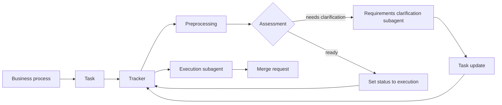
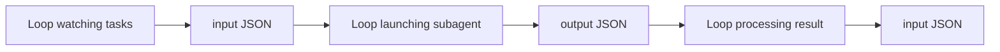

# Architecture Scheme

## Source

- Excalidraw room: `https://excalidraw.com/#room=7ae73c4cdabd554ffdc9,uxtWZeYav-Yd2Mi_cFOidA`
- Extracted on: `2026-04-24`
- Source type: live Excalidraw room, decrypted from the room id and room key in the URL.

## Purpose

This document captures the architectural intent from the Excalidraw scheme. The scheme is a planning artifact, not a full implementation contract. `docs/vision/system.md` remains the durable MVP system vision, while `instration/project.md` keeps migration-era implementation details.

The scheme has two main layers:

- business process: how a task moves from backlog/tracker to execution, clarification, and merge request;
- technical runtime: loops, subagents, input/output JSON, API, and statistics storage.

## Business Process

The high-level flow is:

### Process Meaning

- A business process produces a task.
- The tracker is the source of task state and the integration point for status changes.
- Before execution, the system performs preprocessing and assessment.
- If requirements are incomplete, a subagent clarifies requirements and updates the task in the tracker.
- If the task is ready, the system moves it to execution and starts the execution subagent.
- Execution produces an MR/PR.

The scheme treats clarification as part of the loop, not as a manual side process. That matters: incomplete task handling should eventually become an explicit workflow state, not an ad hoc failure.

## Technical Runtime

The technical part of the scheme describes three loops:

### Runtime Meaning

- The task watcher loop observes tracker/API tasks and prepares structured input.
- The launcher loop starts the selected subagent with input JSON.
- The result-processing loop reads output JSON and decides the next transition.
- JSON is the handoff contract between orchestration steps.
- The runtime should keep enough state to resume and audit each transition.

This maps to the current MVP as Worker 1, Worker 2, Worker 3, task payloads, task result payloads, and persistent task statuses.

## Agent Roles

The scheme lists these agent roles:

| Role | Scope in scheme | MVP status |
| --- | --- | --- |
| Orchestrator | Coordinates task flow and invokes other agents. | Baseline concept. |
| PM agent | Converts tasks into the correct format. | Future extension unless promoted into a task. |
| Architect agent | Designs architecture for significant work. | Future extension. |
| Implementer agent | Implements code changes. | Baseline concept through `AgentRunnerProtocol`. |
| Researcher agent | Performs research before implementation. | Future extension. |
| Reviewer agent | Reviews implementation. | Future extension in runtime; current repo uses review artifacts for task workflow. |
| Test writer agent | Writes tests. | Future extension as separate role. |
| QA agent | Checks acceptance criteria. | Future extension. |
| CI/CD agent | Handles delivery pipeline checks. | Future extension. |

The implementation should not add all roles just because the scheme names them. The MVP needs the boundaries that make those roles replaceable later: structured task context, explicit role field, agent runner boundary, durable result payloads, and review/follow-up task records.

## Agent Handoff

The scheme says agents share results through:

- a common progress file per task;
- invocation of the next agent.

In this repository, that intent maps to:

- `worklog/<username>/<worklog-id>/tasks/taskNN_progress.md` for local human-readable execution progress;
- `tasks.context`, `tasks.input_payload`, and `tasks.result_payload` for durable runtime handoff;
- child tasks for follow-up work, especially `pr_feedback`.

Do not hide handoff state inside agent prompts only. If a later agent needs the result, the orchestrator must persist it.

## Observability And Statistics

The scheme explicitly calls for per-agent statistics:

- token usage;
- tools used;
- tool usage broken down by tokens;
- cost;
- agent runtime.

The current MVP already covers token usage and cost through `token_usage` and the stats API. The following are still architecture-level follow-ups:

- per-agent runtime duration;
- tool usage records;
- tool-to-token attribution;
- per-role aggregation.

## API And Storage

The scheme includes:

- API as a system entry point;
- statistics database;
- input JSON and output JSON as runtime contracts.

Current MVP mapping:

| Scheme concept | Current repository concept |
| --- | --- |
| API | Flask API under `src/backend/api` |
| Input JSON | `tasks.input_payload`, task context schemas |
| Output JSON | `tasks.result_payload` |
| Statistics database | `token_usage` table and stats endpoint |
| Agent prompt defaults | `agent_prompts` table seeded from `prompts/agents/*.md` during DB bootstrap and exposed through `/prompts` API endpoints |
| Runtime setting defaults | `application_settings` table seeded during DB bootstrap and exposed through `/settings` API endpoints |
| Task watcher loop | Worker 1 |
| Subagent launcher loop | Worker 2 |
| Result processing loop | Worker 2 finalization and Worker 3 delivery |

Default agent prompts are stored durably and can be listed, read, and edited through the API,
but current runner behavior does not read prompts from the database.

Runtime settings for non-secret operational values are also stored durably. Env values provide
bootstrap defaults, persisted DB values take priority on process startup, and UI edits apply after
API/worker restart.

## Backlog From Scheme

The blue backlog area in the scheme contains setup and implementation work:

- repository access;
- deployment server preparation;
- business process/pipeline refinement;
- repository preparation;
- project skeleton;
- agent prompts.

Names in the scheme, such as team member names, are planning ownership notes and not product architecture.

## Scope Notes

The scheme supports the current MVP direction, but it also contains ideas that should stay out of scope until captured as separate tasks:

- separate PM, Architect, Researcher, Reviewer, Test Writer, QA, and CI/CD agents;
- automatic requirement clarification loop;
- explicit runtime tool-usage accounting;
- per-agent runtime metrics;
- deployment automation.

The immediate architectural priority is not to add more agents. The priority is to keep the task lifecycle explicit enough that those agents can be introduced without rewriting persistence and worker boundaries.
